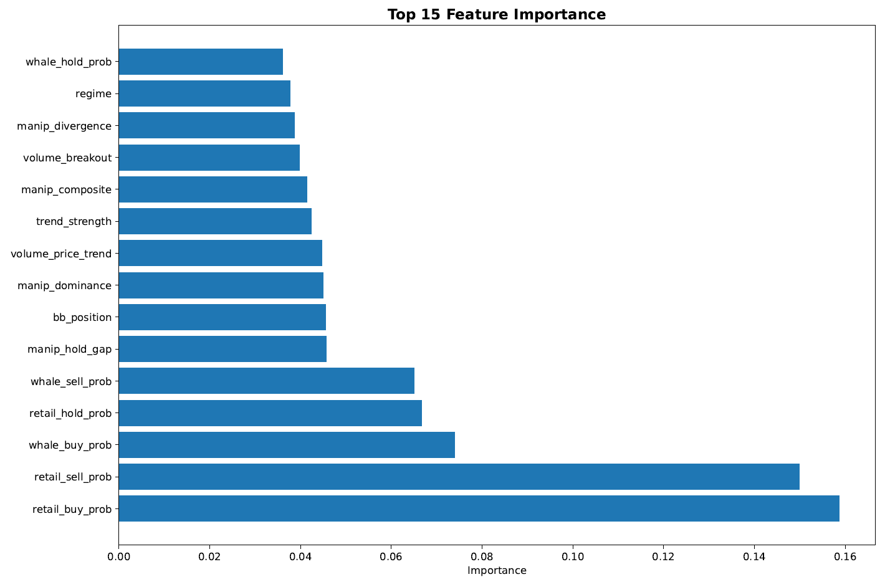
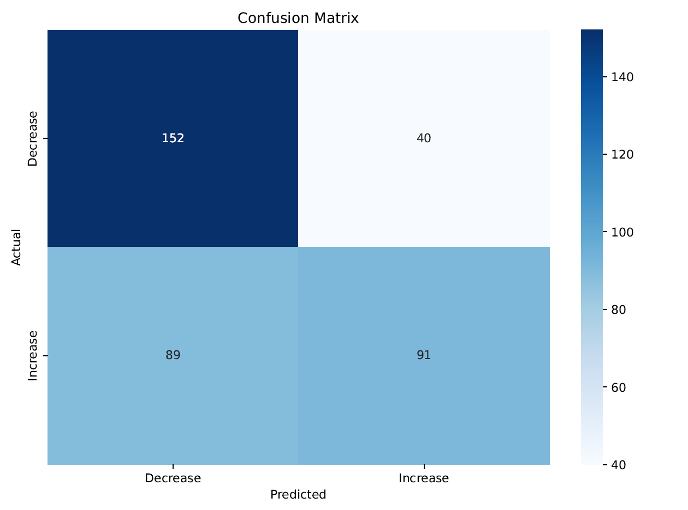
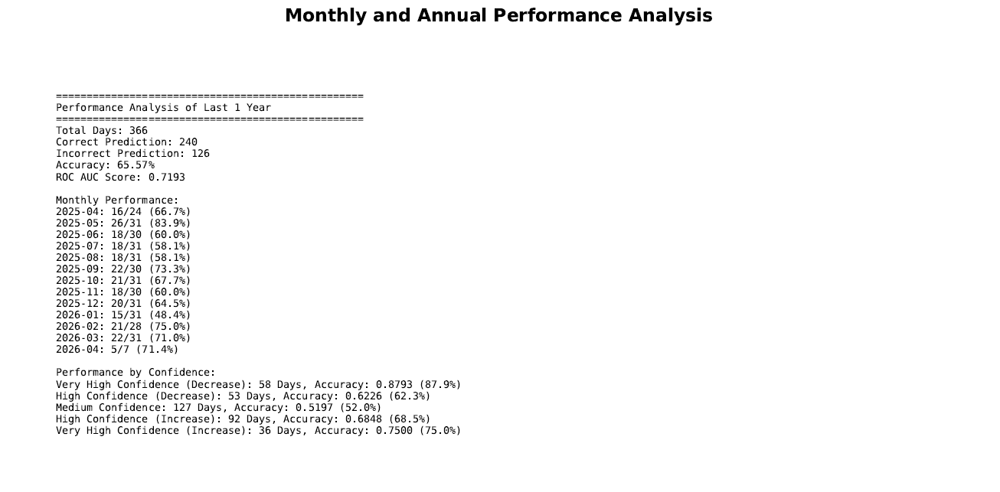
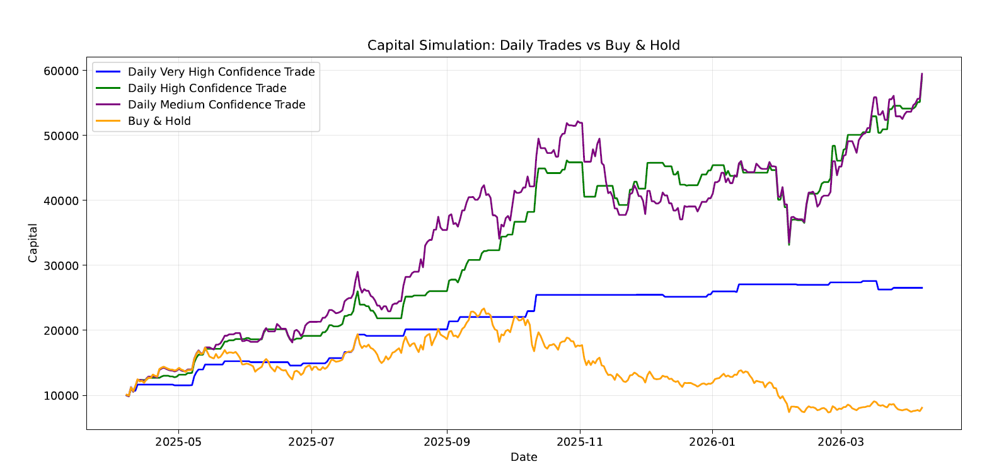
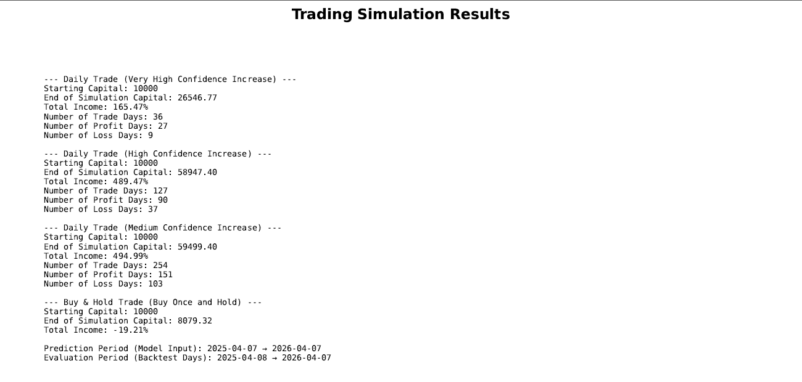

# 📈 Behavioral Market Forecasting with Multi-Agent Reinforcement Learning (MARL)

> **Technical Note:** To protect intellectual property and personal data, the core source code and the original internship report have been kept proprietary. This repository is a technical portfolio showcasing the architecture and simulation results.

---

##Executive Summary
This project introduces a **behavioral finance framework** designed to predict the price direction of Solana (SOL) by modeling the interactions between different market participants. Unlike traditional models that rely on pure price patterns, this system identifies **Whale (Institutional)** and **Retail (Individual)** behaviors to detect manipulation and trend reversals.

##System Architecture

### 1. Behavioral ETL & Feature Engineering
The core indicator of this project is the **Volume Ratio**, which filters the noise to identify the primary actors:

$$Volume\_Ratio = \frac{Volume_t}{Number\_of\_Trades_t}$$

* **Participant Segmentation:** Activity is categorized using 10-day rolling quantiles ($Q$):
    * **Whales:** $Q_{80}$ (High), $Q_{70}$ (Medium), $Q_{60}$ (Low).
    * **Retail:** $Q_{20}$ (High), $Q_{30}$ (Medium), $Q_{40}$ (Low).
* **Manipulation Score:** A heuristic score derived from Whale-Retail **Divergence**, **Dominance**, and **Hold Gap** to quantify "unnatural" market movements.

### 2. The MARL Engine
A custom reinforcement learning environment was built where independent agents simulate market dynamics:
* **Whale Agent:** Models institutional trend-setting and high-volume impact.
* **Retail Agent:** Models sentiment-driven and often emotional trading patterns.
* **Adaptive Exploration:** To prevent local optima, an $\epsilon$-decay strategy was implemented that increases exploration if learning progress stalls.

### 3. Predictive Model (XGBoost)
The final decision layer is an **XGBoost Classifier** that aggregates MARL probability distributions and technical indicators.
* **Validation:** 5-fold TimeSeries Split was used to ensure zero look-ahead bias and robust generalization across different market regimes.

---

##Results & Performance

The model was tested on a 10% unseen hold-out dataset representing a highly volatile market regime.

| Metric | Result |
| :--- | :--- |
| **Final Test Accuracy** | **61.26%** |
| **ROC AUC Score** | **0.6728** |
| **Very High Conf. Accuracy (Increase)** | **81.48%** |
| **Risk Avoidance (Decrease Recall)** | **74.00%** |

###Trading Simulation (1-Year Backtest)
The simulation started with **$10,000** initial capital.

* **High Confidence Strategy:** Reached **$62,926.89** (**+529.27% ROI**).
* **Buy & Hold Benchmark:** Ended at **$4,139.77** (**-58.60% Loss**).

---

## 🖼 Visual Evidence
Agent Probabilities Heatmap
### Agent Probabilities Heatmap:

*Figure: Agent Probabilities Heatmap*

### Feature Importance

*Figure: Contribution of MARL behavioral probabilities vs. technical indicators.*

### Confusion Matrix:

*Figure: Confusion Matrix of the Predictions*

### Monthly and Annual Performance Analysis

*Figure: Monthly and Annual Performance Analysis*

### Capital Growth Comparison

*Figure: Comparison of the model's strategies vs. Buy & Hold over 365 days*

### Trading Simulation Results

*Figure: Trading Simulation Results*

---

## 📬 Contact
For a detailed technical walkthrough or to discuss the findings, feel free to reach out via **[LinkedIn](https://www.linkedin.com/in/huseyinasimferik)**.
