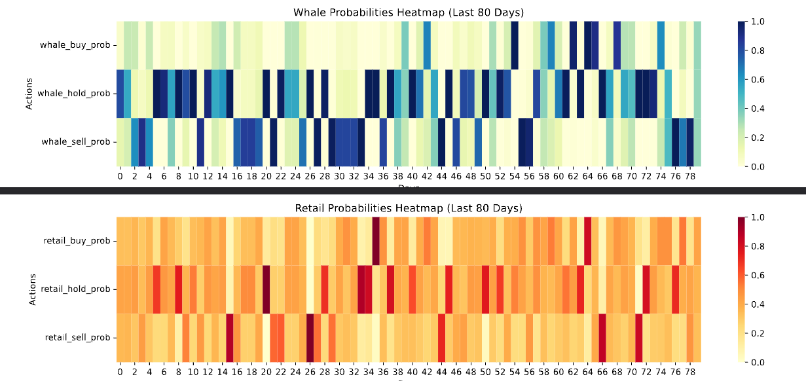

# Behavioral Market Forecasting with Multi-Agent Reinforcement Learning (MARL)
 

 
> **Technical Note:** To protect intellectual property and personal data, I have kept the core source code and the original internship report proprietary. This repository serves as my technical portfolio, showcasing the architecture, behavioral heuristics, and simulation results I developed during my internship at Sade Software and Consulting.
 
---
 
## Executive Summary
In this project, I developed a **behavioral finance framework** to predict the price direction of Solana (SOL/USDT) using 5 years of daily data sourced from the Binance API. My approach focuses on modeling the interactions between different market participants—specifically "Whales" (Institutional) and "Retail" (Individual) traders. Unlike traditional models that rely only on price patterns, I designed this system to detect market manipulation and trend reversals by identifying the volumetric footprints of these actors. As a student at METU, this project allowed me to combine academic rigor with real-world financial data science.
 
## System Architecture
 
### 1. Behavioral Feature Engineering & ETL
I built the foundation of my model on the **Volume Ratio** metric. I used this to filter market noise and identify who is leading the price action at any given time. This ratio represents the average size of a single trade:
 
$$\text{Volume Ratio} = \frac{\text{Volume}_t}{\text{Number of Trades}_t}$$
 
* **My Segmentation Logic:** I categorized market activity using dynamic 10-day rolling quantiles ($Q$). This ensures that my definition of a "Whale" adapts to changing market liquidity.
    * **Whales:** Identified by the highest volume-per-trade thresholds ($Q_{80}, Q_{70}, Q_{60}$).
    * **Retail:** Identified by lower thresholds ($Q_{20}, Q_{30}, Q_{40}$), representing smaller, more frequent trades.
* **Sentiment Modeling:** I created features to track **Accumulation** (buying) and **Distribution** (selling) for each group. I also implemented indicators to detect emotional extremes, which I labeled as **FOMO** and **Panic**.
 
### 2. Manipulation Analysis Heuristics
I developed a unique heuristic module to quantify "unnatural" market movements. I formulated a **Composite Manipulation Score** ($S_{composite}$) to identify potential market traps:
 
$$S_{composite} = \alpha \cdot D + \beta \cdot L + \gamma \cdot H$$
 
* **Divergence ($D$):** Measures the disagreement between Whale and Retail positions.
* **Dominance ($L$):** Uses a logarithmic scale to measure the relative strength of Whales over Retail.
* **Hold Gap ($H$):** Captures the total exposure difference between the two groups.
 
### 3. The MARL Engine (Multi-Agent Reinforcement Learning)
The core of my system is a Multi-Agent environment where I trained two independent Q-Learning agents:
* **Whale Agent:** Optimized to learn institutional strategies and trend-setting behaviors.
* **Retail Agent:** Designed to model sentiment-driven and momentum-heavy patterns.
* **Alignment Reward:** Agents receive higher rewards if their actions align, confirming trend strength through participant agreement.
* **Adaptive Exploration:** If the model stops making learning progress, it automatically increases exploration to find better strategies in volatile regimes.
 
### 4. Final Predictive Model (XGBoost)
I used an **XGBoost Classifier** as the final decision layer. It aggregates the probabilities from my MARL agents with technical indicators. To ensure my results were honest and robust, I used a 5-fold **TimeSeries Split**, which prevents the model from "seeing" future data during training.
 
---
 
## Results & Performance
 
| Metric | Result | Notes |
| :--- | :--- | :--- |
| **Final Test Accuracy** | **61.26%** | Significant predictive edge in a volatile crypto market |
| **ROC AUC Score** | **0.6728** | Strong ability to distinguish between up and down moves |
| **High Conf. Accuracy (Increase)** | **81.48%** | Success rate when model is very confident ($P > 0.7$) |
| **High Conf. Accuracy (Decrease)** | **77.94%** | Strong downward signal identification ($P < 0.25$) |
| **Risk Avoidance (Recall)** | **74.00%** | Highly effective at identifying and avoiding downward trends |
 
### Trading Simulation (1-Year Backtest, Apr 2025 – Apr 2026)
Starting capital: **$10,000** | Benchmark period: **2025-04-08 → 2026-04-07**
 
> This simulation uses 0.15% fee + slippage per trade. Assumes daily close-to-close execution with a T+1 signal delay (signal generated on day T, trade executed at T+1 close price).
 
| Strategy | Final Capital | ROI | Trade Days |
| :--- | :--- | :--- | :--- |
| **Very High Confidence** ($P > 0.7$) | $26,546.77 | +165.47% | 36 |
| **High Confidence** ($P > 0.5$) | $58,947.40 | +489.47% | 127 |
| **Medium Confidence** ($P > 0.35$) | $59,499.40 | +494.99% | 254 |
| **Buy & Hold Benchmark** | $8,079.32 | -19.21% | — |
 
---
 
## Visual Evidence & Detailed Analysis
 
### Agent Probabilities Heatmap

 
The Whale agent's high-confidence signals often act as a leading indicator. When the heatmap shows Whale accumulation while Retail remains indecisive, it typically precedes a healthy trend.
 
### Feature Importance

 
The behavioral probabilities generated by the MARL agents (Retail Sell/Buy Prob) completely dominate the model's decision-making, ranking far above standard indicators like RSI or Bollinger Bands. This validates the core thesis: in crypto, understanding *who* is trading matters more than just the price pattern.
 
### Confusion Matrix

 
The model successfully caught 74% of all downward movements. This means the system functions not just as a profit generator, but as a risk shield — signaling when to move to cash.
 
### Performance Distribution

 
Monthly accuracy ranged from 48.4% (Jan 2026) to 83.9% (May 2025), reflecting shifting market regimes. The model performs strongest during periods with a clear behavioral trend.
 
### Capital Growth Comparison

 
While the market declined ~19% over the evaluation period, the High Confidence strategy grew capital nearly 5x. This demonstrates that behavioral modeling can generate Alpha even in a bearish environment.
 
### Detailed Simulation Metrics

 
Trade-by-trade breakdown including profit/loss day counts across all confidence tiers.
 
---
 
## Limitations
 
* **Variable monthly performance** (48%–84%) — model accuracy depends on market regime
* **Daily predictions only** — not suitable for intraday or multi-day holding strategies
* **Idealized execution** — real trading may face additional slippage or liquidity constraints
* **No external signals** — news, on-chain data, and social sentiment are not incorporated
 
---
 
## Contact
For a detailed technical walkthrough or to discuss the findings, feel free to reach out via **[LinkedIn](https://www.linkedin.com/in/huseyinasimferik)** or **[Gmail](mailto:huseyinasimferik@gmail.com)**.
